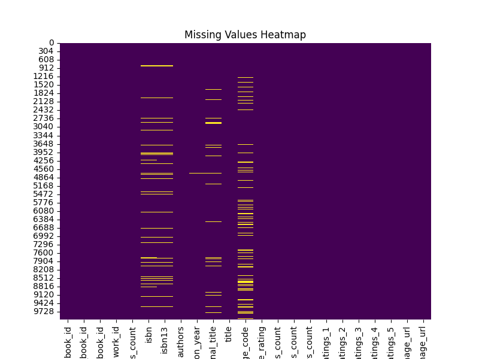
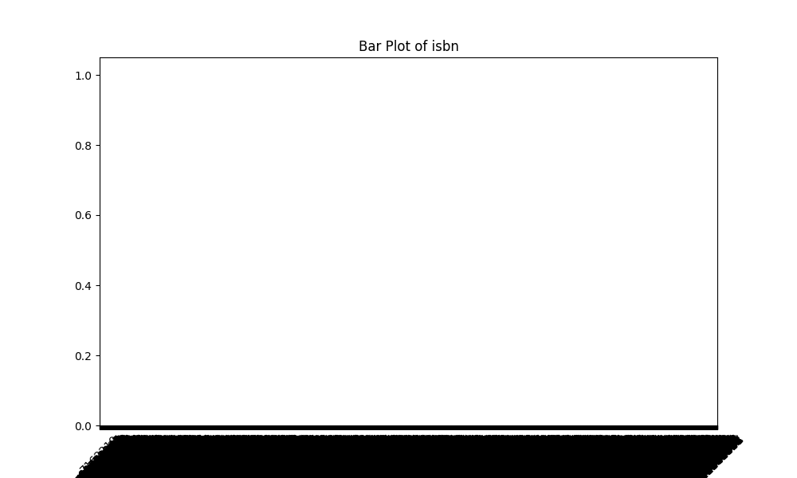

# Automated Analysis Report
### Detailed Analysis of the Dataset Overview

#### 1. Structure and Quality of the Dataset

The dataset contains 10,000 entries, with multiple columns, each providing specific details about books. The columns include numerical, categorical, and textual data.

**Columns Overview:**
- **Identifying columns:** `book_id`, `goodreads_book_id`, `best_book_id`, and `work_id` serve as identifiers for the books and their respective unique records on the Goodreads platform.
- **Book details:** Information on the book itself is captured via `title`, `original_title`, `authors`, `original_publication_year`, `isbn`, `isbn13`, and an indication of language through `language_code`.
- **Ratings and reviews:** Columns like `average_rating`, `ratings_count`, `work_ratings_count`, `work_text_reviews_count`, and specific ratings (`ratings_1` to `ratings_5`) provide information on how the books are perceived and rated by readers.
- **Book metadata:** Properties like `books_count`, `image_url`, and `small_image_url` further enrich the dataset.

**Quality Assessment:**
- **Missing Values:** There are several missing values across various columns, especially in `isbn` (700 missing), `isbn13` (585 missing), `original_publication_year` (21 missing), `original_title` (585 missing), and `language_code` (1,084 missing). The presence of missing values could affect analyses involving these columns.
- **Unique Entries:** The `isbn` field demonstrates uniqueness with 9,300 unique ISBNs out of 10,000 entries, indicating a well-structured representation of books. However, 700 missing values signify that there may be entries without ISBN information, which could hamper certain types of book identification and tracking.
- **Categorical Variety:** The dataset records 25 unique language codes, with 'eng' being the most common. The presence of multiple unique authors (4,664) suggests diversity in the dataset.
- **Statistical Distribution:** Many columns show a standard deviation indicating variance (notably `ratings_count` and `work_ratings_count`), suggesting a few records are significantly different from the mean.

#### 2. Key Patterns or Anomalies

- **Ratings Correlation:** The correlation matrix illustrates strong relationships among various ratings columns, especially between `ratings_4` and `ratings_5` (0.933) and between `ratings_3` and `ratings_4` (0.952). The high correlations indicate that these ratings may be producing similar results, which might imply redundancy in these features when aiming for model predicting book ratings.
- **Books Count Anomaly:** The `books_count` variable ranges dramatically, with a maximum of 3,455 books recorded by a single entry. This suggests that certain authors have significantly larger bibliographies than others, which could skew ratings and averages based on output volume.
- **Original Publication Year:** The original publication year varying widely (with records as low as -1750) may introduce inaccuracies or misrepresentations in analyses related to publication trends or age of literature, as it indicates a potential issue in data entry or encoding.
  
#### 3. Possible Real-World Implications

- **Publishing Trends:** This dataset could be valuable for understanding trends in literature, such as how publication years correlate with average ratings or the frequency of genres or authors over time.
- **Author Studies:** The large number of unique authors and subsequent ratings could allow for deeper investigations into author popularity, the impact of an author’s publication volume on ratings, and how bestseller status influences perceptions.
- **Market Research:** Publishers could use average ratings and reviews counts to make decisions about marketing strategies, resource allocations, or promotional efforts. Books with high average ratings and high ratings counts could indicate safer bets for publishers.
- **Social Validation:** Strong correlations of ratings data imply that a reader's satisfaction may stem from how others rate a book, creating potential herd behavior effects impacting purchasing behaviors. 
- **Data-Driven Recommendations:** Analysis of the dataset, considering both the attributes and relationships, could enhance algorithmic recommendations on platforms like Goodreads, directly impacting user experiences and engagement.

### Conclusion

The given dataset on books is comprehensive and rich with both quantitative and qualitative insights. While it presents a wide variety of useful data points, careful consideration of its anomalies and missing values is necessary to harness its full analytical potential. The identification of key patterns, particularly in ratings, and understanding the implications can aid various stakeholders in the literary ecosystem, from authors to publishers and readers.

