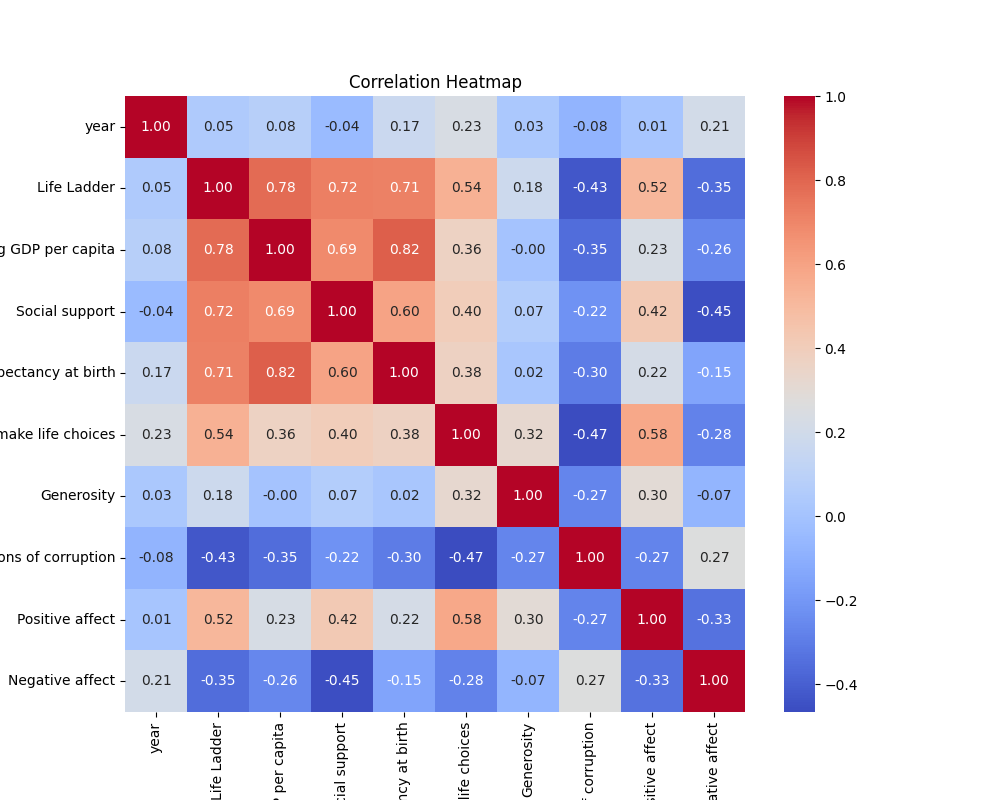

# Automated Analysis Report
### 1. The Structure and Quality of the Dataset

#### Structure
The dataset under analysis encompasses various metrics related to well-being and socio-economic factors across 165 unique countries collected over a period spanning from 2005 to 2023. The dataset contains 2363 rows, with the following significant fields:

- **Country name**: A categorical variable representing the name of each country. It has no missing values, with Lebanon appearing most frequently (18 times).
- **Year**: A numerical variable indicating the year of data collection, with a mean year of approximately 2014.76 and a range from 2005 to 2023.
- **Life Ladder**: A numerical representation of well-being, with a mean score of approximately 5.48, measured on a scale that could extend from 1.281 to 8.019.
- **Log GDP per capita**: Indicates the logarithmic value of GDP per capita, with a mean of about 9.4 and covering a substantial range.
- **Social support, Healthy life expectancy at birth, Freedom to make life choices**: Various metrics pertaining to quality of life, each with its descriptive statistics that suggest differing levels of completeness due to missing values.
- **Generosity, Perceptions of corruption, Positive affect, Negative affect**: Psychological and social indicators. These are marked by variable levels of observability, with some showing significant missing data (e.g., Generosity has 81 missing values).

#### Quality
The dataset exhibits several issues related to quality, primarily indicated by missing values:
- **Healthy life expectancy at birth** has the highest number of missing values (63), representing approximately 2.66% of the total entries.
- Other attributes, such as **Freedom to make life choices** (36 missing) and **Generosity** (81 missing), could potentially skew results or reduce the accuracy of analyses. The notable percentages of missing data urge caution in interpreting correlation and relationships among variables.
- Essential categories, like the **Country name**, do not have any missing values, enhancing the dataset's reliability in that aspect.

### 2. Key Patterns or Anomalies

- **Positive Correlations**: The **Life Ladder** shows strong positive correlations with **Log GDP per capita** (0.78) and **Social support** (0.72). This suggests that higher GDP per capita and increased social support are significantly linked with improved perceptions of well-being.
- **Negative Affect**: It has a notable negative correlation with **Life Ladder** (-0.352) and moderate correlations with various factors, indicating that increased negative affect is associated with reduced well-being.
- **Generosity**: The correlation between **Generosity** and other metrics, particularly with GDP and well-being measures, is weak. This raises a question regarding its relevance in this context and suggests potential underreporting or measurement issues.
  
#### Anomalies
- The maximum for **Healthy life expectancy at birth** is 74.6, which may not fully reflect expected values globally and could represent discrepancies in data collection or reporting practices across countries.
- The correlation of variables like **Freedom to make life choices** and **Negative affect** further shows an unexpected contrary relationship. These factors are often expected to correlate positively and suggest complexities in how they interact in different societies.

### 3. Possible Real-World Implications

The findings from this dataset can provide insights beneficial for policymakers, researchers, and social scientists in several ways:

- **Policy Formulation**: Understanding the correlations between economic indicators (like GDP) and subjective well-being can guide fiscal policies to enhance quality of life. For example, increasing investment in social support systems may lead to higher life satisfaction scores.
- **Social Support Initiatives**: The strong link between social support and well-being underscores the necessity for community-building programs and social safety nets tailored to the unique needs of developing nations.
- **Generosity Insights**: The weak correlation with generosity raises a call for further exploration into cultural factors influencing charitable behaviors and how these could be improved to foster more communal support.
- **Addressing Negative Affect**: Programs aimed at reducing negative affect through mental health resources could potentially improve life satisfaction across various demographics, evidenced by the correlation with the Life Ladder.
- **Longitudinal Studies**: Trends reflected in yearly data can facilitate future research into how socio-economic crises (such as pandemics or economic downturns) affect life satisfaction and well-being over time.

In conclusion, while the dataset provides a fruitful resource for revealing intricate relationships among well-being-associated factors, the presence of missing values and correlation inconsistencies requires careful consideration during analysis and interpretation of findings.

