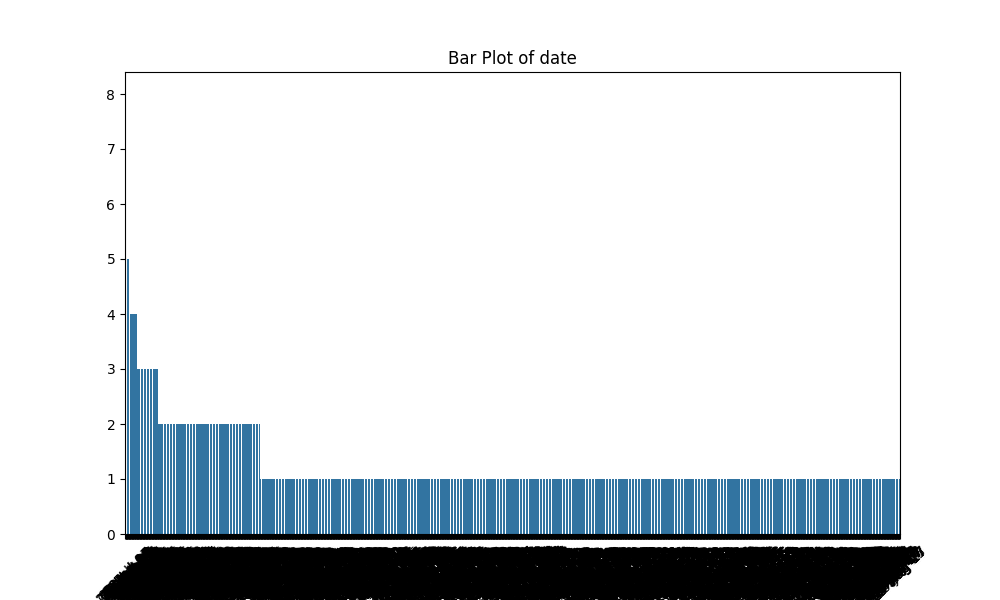

# Automated Analysis Report
### Detailed Analysis of the Dataset

#### 1. Structure and Quality of the Dataset

The dataset appears to contain 2,652 entries across several fields, including date, language, type, title, by (presumably the creator or actor), overall rating, quality rating, and repeatability. 

**Key Features:**
- **Date**: This column contains 2,553 entries, with 99 missing values. There are 2,055 unique dates, suggesting a broad time span but also a sparsely populated set of dates where certain dates may recur due to frequent releases or events. 
- **Language**: There are no missing values with 11 unique languages, and 'English' is the most represented, indicating the dataset may have a strong bias towards English-language content.
- **Type**: This column categorizes the entries into types, such as movie and potentially series. There are 8 unique types, with 'movie' being the most frequent, reflecting a possible focus on film-related content.
- **Title**: With 2,312 unique titles, the dataset exhibits a rich variety of content, although the top title 'Kanda Naal Mudhal' appears only 9 times, indicating that entries feature a wide array of titles without heavy repetition.
- **By**: This feature shows missing values (262 entries), with a substantial number of unique creators/actors (1,528). The top figure, Kiefer Sutherland, has 48 entries, suggesting that not all entries are evenly represented in terms of creators.
- **Overall**, **quality**, and **repeatability**: These numeric ratings show no missing values and provide a means to assess the critical reception of the content based on mean scores and distribution metrics. The mean overall rating (≈3.05) and quality rating (≈3.21) suggest a moderate reception, while repeatability scores imply a variable interest in content revisiting (mean of ≈1.49).

**Quality Assessment**: 
- The dataset has completeness issues, particularly in the 'date' and 'by' columns. These missing values could impact analysis and interpretation, particularly if a significant portion of any missing values could skew results.
- The categorical columns yield a wealth of unique values, but the patterns are indicative of potential biases (e.g., language and type) which must be considered in analysis.
- The numerical columns seem well-formed with no missing values, allowing for reliable statistical analysis.

#### 2. Key Patterns or Anomalies

**Patterns:**
- The correlation matrix highlights strong relationships between the 'overall' and 'quality' ratings (0.826), suggesting that entries perceived as high quality are also viewed favorably overall. A moderate relationship exists between 'overall' and 'repeatability' (0.513), indicating that works which score higher on average might encourage repeat viewing.
- The majority of entries seem to reflect positive ratings (mean around 3), which can imply that the data collected might lean towards favored content or higher-rated reviews.

**Anomalies:**
- The large number of missing values in the 'date' and 'by' columns can pose significant issues; understanding why so many entries lack these specific details could indicate gaps in data collection practices.
- The top category 'language' is dominated by English, which suggests potential underrepresentation of non-English content. 
- The disparity in creator representation (the leading name holds 48 entries while many others hold far fewer) indicates the likelihood of popularity biases within the dataset.

#### 3. Possible Real-World Implications

The implications of the findings from this dataset can be significant:

- **Content Creation & Marketing**: The correlation between overall ratings and quality ratings encourages content creators to focus on high-quality productions to drive positive reception. An insight into the types and languages most favored can guide marketing strategies for future releases.
  
- **Diversity and Representation**: The dataset's apparent bias towards English-language films and certain creators could indicate a gap in diversity, raising questions about representation in media. Stakeholders might use this analysis to push for a broader array of languages and creators.

- **Viewing Trends**: Insight into repeatability scores can illuminate viewer behaviors and preferences, potentially guiding programming decisions for media platforms. A higher repeatability score can indicate strong emotional connections to the content, which could be exploited when marketing or programming content.

In conclusion, while the dataset presents an effective overview for analysis, addressing its missing values, visualizing data distributions, and considering biases will enhance understanding and resultant implications in real-world contexts. This analysis positions stakeholders to make informed decisions and strategize effectively in audiovisual content production and consumption.

